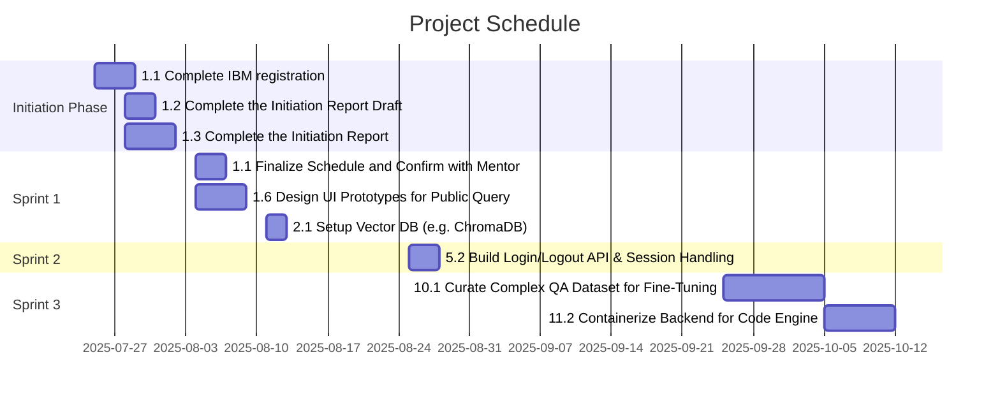

```mermaid
gantt
  title Project Schedule
  dateFormat  YYYY-MM-DD
  section Initiation Phase
  1.1 Complete IBM registration : 2025-07-25,4d
  section Initiation Phase
  1.2 Complete the Initiation Report Draft : 2025-07-28,3d
  section Initiation Phase
  1.3 Complete the Initiation Report : 2025-07-28,5d
  section Sprint 1
  1.1 Finalize Schedule and Confirm with Mentor : 2025-08-04,3d
  1.6 Design UI Prototypes for Public Query : 2025-08-04,5d
  2.1 Setup Vector DB (e.g. ChromaDB) : 2025-08-11,2d
  section Sprint 2
  5.2 Build Login/Logout API & Session Handling : 2025-08-25,3d
  section Sprint 3
  10.1 Curate Complex QA Dataset for Fine-Tuning : 2025-09-25,10d
  11.2 Containerize Backend for Code Engine : 2025-10-05,7d
```
